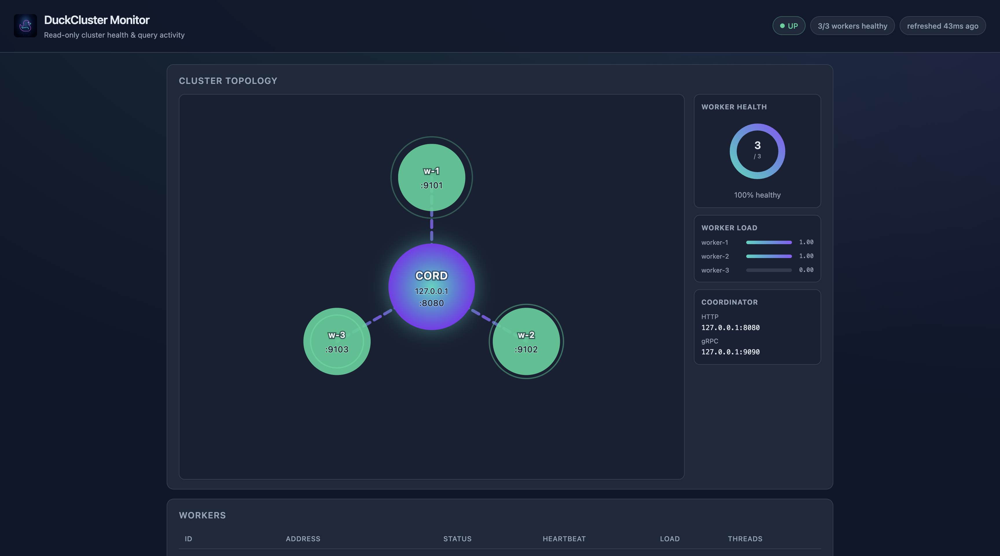
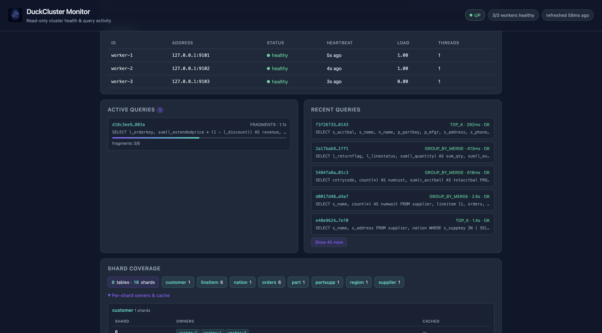
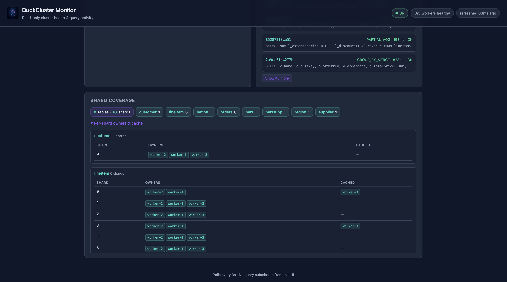
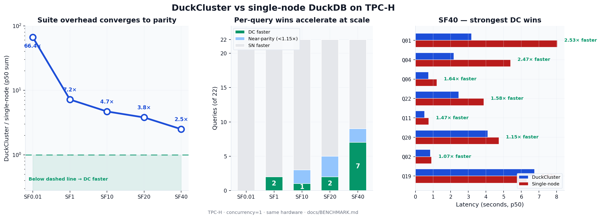
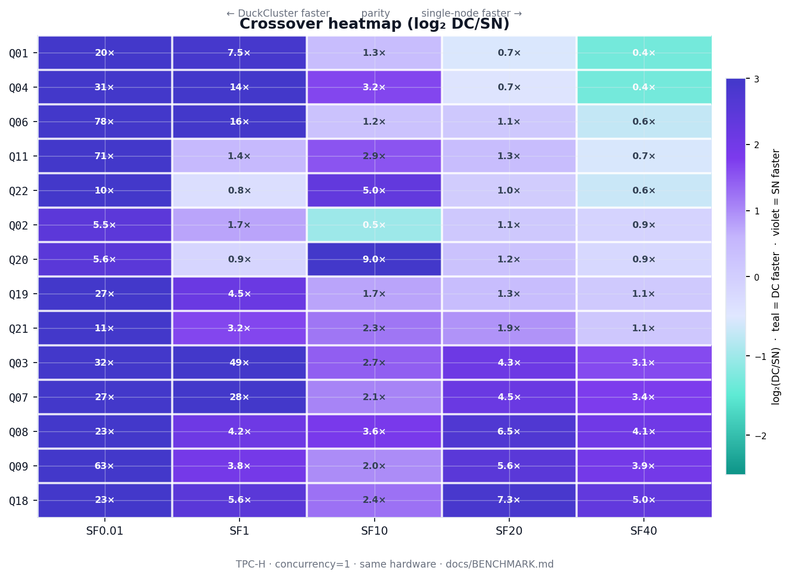
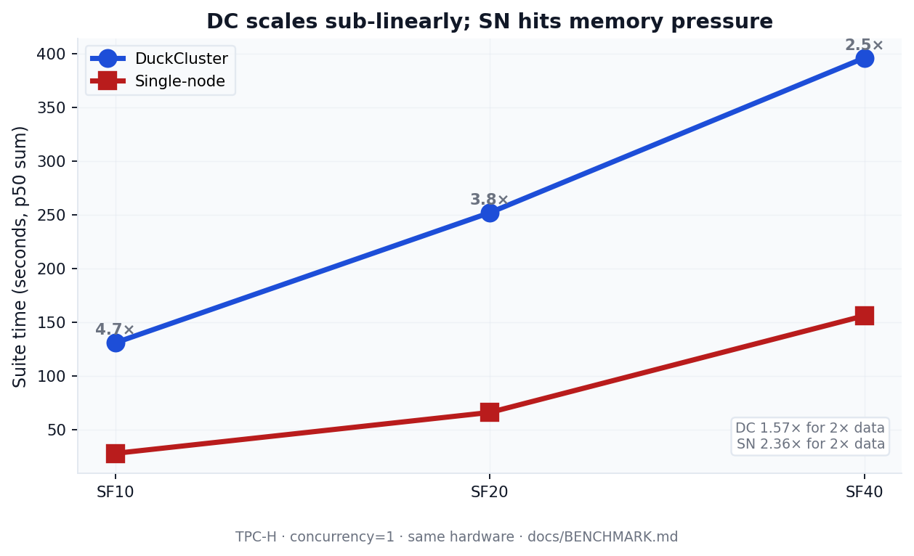
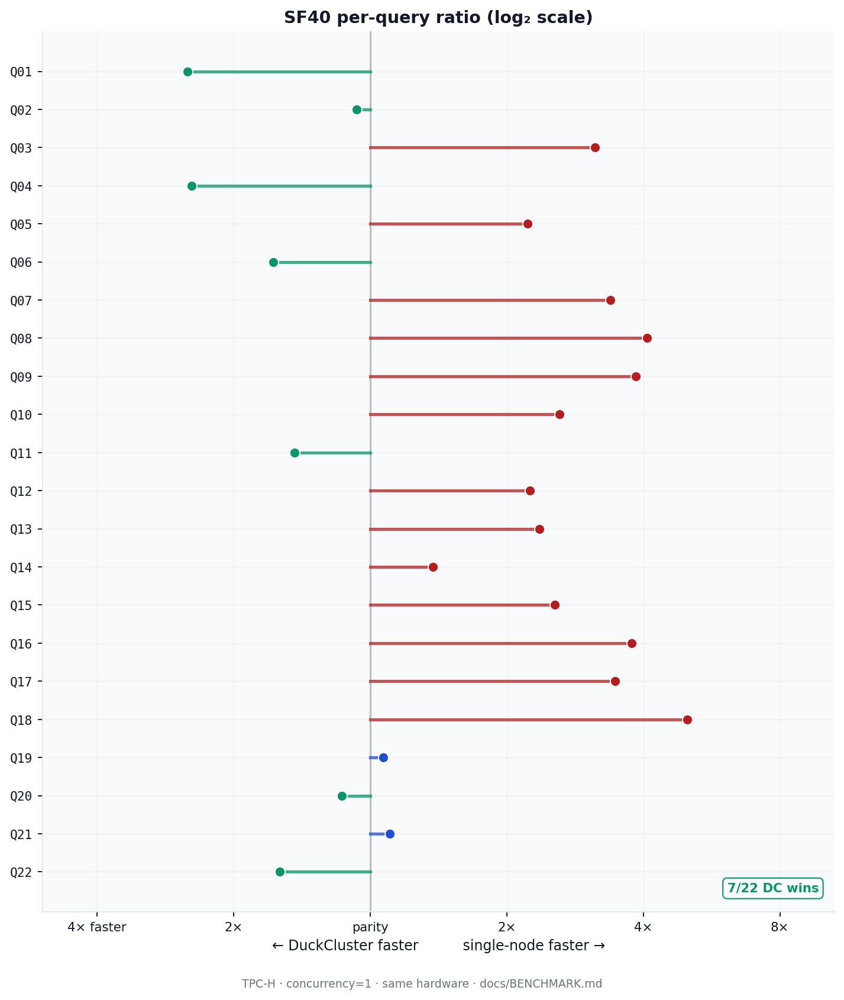
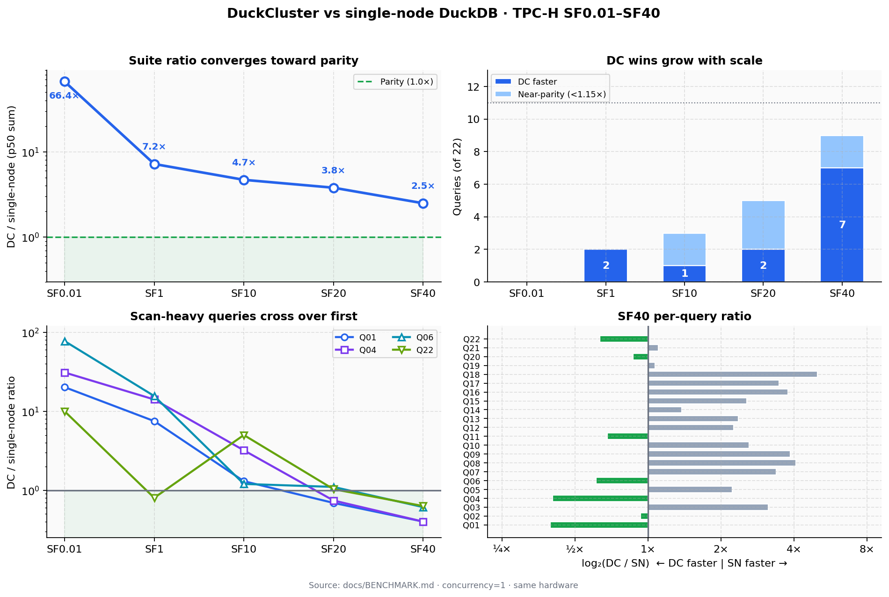

<h1>
  
  DuckCluster
</h1>

A **distributed SQL query coordinator** for analytical workloads. Clients submit SQL over a REST API; DuckCluster plans the query with Apache Calcite, executes shard-local fragments on **DuckDB worker nodes**, streams partial results over gRPC, and merges them into a final answer.

For design details, see [DESIGN-DECISIONS.md](docs/DESIGN-DECISIONS.md) and [DESIGN-planner.md](docs/DESIGN-planner.md).

---

## How it works

```
Client SQL
    │
    ▼
Coordinator (REST + Calcite planner)
    ├─ Classify tables (driving vs broadcast), detect merge strategy
    ├─ Generate N fragment SQL (qualified catalog.table names, UNION ALL for broadcast)
    ├─ Resolve target workers (3-tier: ring owners → cached → remote read)
    ├─ Prefetch broadcast shards to target workers (if JOIN)
    └─ Dispatch fragments in parallel via persistent gRPC channels
           │
           ▼
    Worker 0 … Worker N  (embedded DuckDB per node, all data local)
           │
           ▼
Coordinator merges partial results (embedded DuckDB)
           │
           ▼
    JSON response
```

**Sharding model:** data is pre-split into `.duckdb` shard files (e.g. `events_shard0.duckdb`) via `split-and-distribute.sh` and distributed to worker data directories independently per table. Workers auto-discover and ATTACH these files at startup. A consistent hash ring determines shard placement with configurable replication factor. Tables can have different shard counts and keys — the coordinator handles JOINs via broadcast shuffle at query time.

**Merge strategies:**


| Strategy         | Use case                          | Worker                | Coordinator                |
| ---------------- | --------------------------------- | --------------------- | -------------------------- |
| `CONCATENATE`    | `SELECT *`, filters               | Return matching rows  | Append batches             |
| `PARTIAL_AGG`    | `SELECT COUNT(*), SUM(x)`         | Partial aggregates    | Re-aggregate in DuckDB     |
| `GROUP_BY_MERGE` | `SELECT k, COUNT(*) … GROUP BY k` | Partial grouped rows  | Final `GROUP BY` in DuckDB |
| `TOP_K`          | `ORDER BY … LIMIT n`              | Local top-K per shard | Global sort + limit        |


---


## Quick start


### Prerequisites

- Java 17+
- Maven 3.8+
- Python 3.10+ (integration tests)
- `curl` (and optionally `python3` for pretty JSON)
- `duckdb` CLI recommended for `start-cluster.sh` (Python `duckdb` package is enough for integration tests)


### Build

```bash
mvn clean package
```


### Run a local cluster

```bash
./scripts/start-cluster.sh
```

This builds the project, splits the bundled sample CSV into shard files, and starts one coordinator (HTTP `8080`, gRPC `9090`) and three workers (`9101`–`9103`).

The default source file is `tests/integration/data/demo-events.csv` (10 rows). Override with:

```bash
DUCKCLUSTER_DEMO_CSV=/path/to/events.csv ./scripts/start-cluster.sh
```


### Submit a query

Start the cluster first (`./scripts/start-cluster.sh`), then use the CLI.

#### Interactive shell

```bash
./scripts/duckcluster          # opens the shell (default when run on a TTY)
./scripts/duckcluster shell    # same as above
```

Inside the shell:

```
duckcluster> \tables
events
duckcluster> SELECT * FROM events;
duckcluster> SELECT category, COUNT(*) AS cnt FROM events GROUP BY category
duckcluster> \status
duckcluster> \q
```

- Type SQL and end with `;`, or press Enter on a **single-line** query (semicolon optional).
- `ORDER BY` must come before `LIMIT`: `SELECT … ORDER BY id LIMIT 5`.
- Up/down arrows recall previous queries exactly as typed (with `;` when you used one).
- Meta-commands: `\tables` `\status` `\workers` `\help` `\q` (or `quit` / `exit`).

#### One-shot query (no shell)

```bash
# Inline SQL
./scripts/duckcluster query "SELECT category, COUNT(*) AS cnt FROM events GROUP BY category"

# SQL from a file
./scripts/duckcluster query -f path/to/query.sql

# JSON for scripts / jq
./scripts/duckcluster query "SELECT COUNT(*) FROM events" --format json

# Stats on stderr (merge strategy, duration, workers)
./scripts/duckcluster query "SELECT COUNT(*) FROM events" -v
```

#### Other commands

```bash
./scripts/duckcluster status     # cluster UP / worker count
./scripts/duckcluster workers    # list workers
```

Install globally: `pip install -e cli/` — then use `duckcluster` instead of `./scripts/duckcluster`.

Full reference and screenshot: **[`cli/README.md`](cli/README.md)**.

The CLI prints results as a table (or JSON with `--format json`) and fails fast when the cluster is down, tables are missing from the shard catalog, or shards have no owners.

Raw REST API (same backend):

```bash
# Simple scan with filter pushdown
curl -s -X POST http://127.0.0.1:8080/v1/query \
  -H 'Content-Type: application/json' \
  -d '{"sql":"SELECT * FROM events WHERE id > 2"}' | python3 -m json.tool

# Distributed GROUP BY
curl -s -X POST http://127.0.0.1:8080/v1/query \
  -H 'Content-Type: application/json' \
  -d '{"sql":"SELECT category, COUNT(*) AS cnt FROM events GROUP BY category"}' | python3 -m json.tool
```


### Cluster health

```bash
curl -s http://127.0.0.1:8080/v1/cluster/health
curl -s http://127.0.0.1:8080/v1/cluster/workers
```

### Monitoring dashboard

After `start-cluster.sh`, open the read-only UI at `http://127.0.0.1:8080/dashboard/index.html` (root `/` redirects there).

**Demo video:** [docs/media/DuckCluster-demo.mp4](docs/media/DuckCluster-demo.mp4)

<p align="center"><b>Cluster topology</b><br>
</p>

<p align="center"><b>Recent queries</b><br>
</p>

<p align="center"><b>Shard catalog</b><br>
</p>

Live status: workers, in-flight queries, recent query history, and shard placement per table.


### Integration tests

Integration tests live under `tests/integration/`. They start ephemeral clusters, shard the source CSV automatically, and compare distributed results against a single-node DuckDB baseline.

```bash
# First-time setup: creates a venv and installs pytest + duckdb
./scripts/run-integration-tests.sh
```

**Options** (passed through to pytest):

```bash
# Default — bundled 10-row sample CSV (tests/integration/data/demo-events.csv)
./scripts/run-integration-tests.sh

# Larger synthetic dataset
./scripts/run-integration-tests.sh --demo-rows 1000

# Custom CSV
./scripts/run-integration-tests.sh --demo-csv /path/to/events.csv
```

**Manual shard setup** (optional — tests shard data themselves, but you can pre-split for exploration):

```bash
mkdir -p data/worker-{1,2,3}
./scripts/split-and-distribute.sh \
  --source tests/integration/data/demo-events.csv \
  --table events \
  --key id \
  --shards 6 \
  --workers worker-1,worker-2,worker-3 \
  --dirs data/worker-1,data/worker-2,data/worker-3 \
  --rf 2
```

Unit tests only:

```bash
mvn test
```

See `[tests/integration/README.md](tests/integration/README.md)` for harness layout and scenario details.

---


## REST API


| Method | Path                  | Description                             |
| ------ | --------------------- | --------------------------------------- |
| `POST` | `/v1/query`           | Execute SQL synchronously               |
| `GET`  | `/v1/cluster/health`  | Cluster liveness summary                |
| `GET`  | `/v1/cluster/workers` | Registered workers and heartbeat status |


**Query request**

```json
{ "sql": "SELECT category, COUNT(*) AS cnt FROM events GROUP BY category" }
```

**Query response**

```json
{
  "queryId": "…",
  "columns": ["category", "cnt"],
  "rows": [["A", 3], ["B", 3], ["C", 3]],
  "stats": {
    "mergeStrategy": "GROUP_BY_MERGE",
    "workersUsed": 3,
    "fragmentsExecuted": 3,
    "durationMs": 120,
    "workerDurationsMs": { "worker-1": 40, "worker-2": 35, "worker-3": 45 }
  }
}
```

---


## Configuration

Environment variables (defaults shown):


| Variable                               | Default                  | Description                           |
| -------------------------------------- | ------------------------ | ------------------------------------- |
| `DUCKCLUSTER_COORDINATOR_HOST`         | `127.0.0.1`              | Coordinator address workers/clients use for gRPC |
| `DUCKCLUSTER_COORDINATOR_HTTP_BIND_HOST` | `0.0.0.0`              | HTTP/dashboard bind address (use `127.0.0.1` to block remote access) |
| `DUCKCLUSTER_COORDINATOR_HTTP_PORT`    | `8080`                   | REST API + dashboard port             |
| `DUCKCLUSTER_COORDINATOR_GRPC_PORT`    | `9090`                   | Worker registration / heartbeat port  |
| `DUCKCLUSTER_HEARTBEAT_INTERVAL_SEC`   | `5`                      | Heartbeat period (seconds)            |
| `DUCKCLUSTER_HEARTBEAT_MISS_THRESHOLD` | `3`                      | Missed beats before worker removed    |
| `DUCKCLUSTER_SHARD_COUNT`              | `3`                      | Logical shard count for demo catalog  |
| `DUCKCLUSTER_DATA_DIR`                 | `./data`                 | Worker data directory for shard files |
| `DUCKCLUSTER_POOL_SIZE`                | `max(2, min(4, CPUs-1))` | DuckDB connections per worker         |
| `DUCKCLUSTER_POOL_WAIT_MS`             | `200`                    | Max wait for a free connection (ms)   |
| `DUCKCLUSTER_REPLICATION_FACTOR`       | `2`                      | Shard copies across workers           |
| `DUCKCLUSTER_VNODES_PER_WORKER`        | `100`                    | Virtual nodes in hash ring            |
| `DUCKCLUSTER_WATCHER_INTERVAL_MS`      | `2000`                   | Shard file polling interval (ms)      |


---


## Project layout

```
DuckCluster/
├── proto/           # Protobuf + gRPC service definitions
├── common/          # Models, config, Calcite planner, consistent hash ring
├── coordinator/     # REST API, query execution, shard catalog, replication
├── worker/          # gRPC server, DuckDB pool, shard manager, file watcher
├── cli/             # duckcluster CLI (pip install -e cli/)
├── scripts/         # start-cluster.sh, duckcluster, split-and-distribute.sh
├── tests/integration/  # Pytest harness + bundled sample CSV
└── docs/
    ├── DESIGN-DECISIONS.md
    ├── DESIGN-planner.md
    ├── BENCHMARK.md
    ├── media/           # Dashboard screenshots + demo video
    └── plots/           # Benchmark charts (generated by scripts/benchmark-plots.py)
```

**Run manually**

```bash
# Coordinator
java -jar coordinator/target/duckcluster-coordinator-0.1.0-SNAPSHOT.jar

# Worker (repeat with worker-1, worker-2, …)
java -jar worker/target/duckcluster-worker-0.1.0-SNAPSHOT.jar worker-1 127.0.0.1 9101
```

---


## Technology stack


| Layer            | Choice                                   |
| ---------------- | ---------------------------------------- |
| Language / build | Java 17, Maven                           |
| REST             | Javalin 6.x                              |
| SQL planning     | Apache Calcite 1.41 (`DuckDBSqlDialect`) |
| Worker OLAP      | DuckDB JDBC                              |
| RPC              | gRPC + Protobuf                          |
| Merge engine     | Embedded DuckDB on coordinator           |
| Tests            | JUnit 5 (unit), pytest (integration)     |


---


## Benchmark — TPC-H vs single-node DuckDB

Full TPC-H (22 queries) benchmarked at **SF0.01–SF40** on identical hardware (single Linux VM, 3 workers + coordinator vs single-node DuckDB baseline). All 22 queries pass correctness verification. TPC-DS is out of scope for now (planner not ready).

**Key results (SF40, ~56 GB, concurrency=1):**

- **7/22 queries outperform single-node DuckDB** — despite DuckCluster running 4 processes vs 1
- **Q01/Q04: DC 60% faster** (0.40×) — parallel lineitem / orders scan
- **Q06: DC 39% faster** (0.61×) — embarrassingly parallel aggregation
- **Suite overhead converging**: 66× (SF0.01) → 7.2× (SF1) → **2.5× (SF40)**
- **Sub-linear DC scaling**: 1.57× latency for 2× data (single-node: 2.36×)



**More charts** (click to expand)

<details>
<summary>Crossover heatmap — green = DuckCluster faster, indigo = single-node faster</summary>



</details>

<details>
<summary>Scaling — suite time SF10→SF40</summary>



</details>

<details>
<summary>SF40 — all 22 queries (dumbbell chart)</summary>



</details>

<details>
<summary>Four-panel summary</summary>



</details>


**Crossover progression (DC/SN ratio):**


| Query | SF0.01 | SF1   | SF10 | SF20  | SF40      |
| ----- | ------ | ----- | ---- | ----- | --------- |
| Q01   | 20.2×  | 7.5×  | 1.3× | 0.69× | **0.40×** |
| Q04   | 31.0×  | 14.1× | 3.2× | 0.74× | **0.40×** |
| Q06   | 77.5×  | 15.6× | 1.2× | 1.1×  | **0.61×** |


Join-heavy queries (Q03/Q07/Q08/Q09/Q18) remain 3–5× slower — broadcast cost per fragment (see Roadmap).

Regenerate plots: `python3 scripts/benchmark-plots.py` (requires matplotlib). Full numbers: [`docs/BENCHMARK.md`](docs/BENCHMARK.md). Optimization history: [`docs/OPTIMIZATIONS.md`](docs/OPTIMIZATIONS.md)

---


## Roadmap

- **Dashboard** — read-only monitoring UI at `/dashboard/` ([demo video](docs/media/DuckCluster-demo.mp4), [screenshots](#monitoring-dashboard)); SSE drill-down pending ([plan](docs/PLAN-dashboard.md))
- **CLI** — shipped: interactive shell + `query` / `status` / `workers` ([guide](cli/README.md), [plan](docs/PLAN-cli.md))
- **Broadcast materialization** — worker-side `__dc_bcast_*` tables (landed; formal re-benchmark pending) — see [OPTIMIZATIONS.md](docs/OPTIMIZATIONS.md)
- **Apache Arrow transfer** — typed columns / Arrow IPC between workers and coordinator for zero-copy merge

---


## Demo data

`tests/integration/data/demo-events.csv` is a committed 10-row sample (`id`, `name`, `score`, `category`).
`start-cluster.sh` and the integration harness use it by default. `split-and-distribute.sh` turns it into
per-worker `.duckdb` shard files; workers discover and ATTACH them via `ShardFileWatcher`.

---


## Development

```bash
# Unit tests
mvn test

# Integration tests (see Integration tests section above)
./scripts/run-integration-tests.sh

# Build shaded JARs
mvn clean package -DskipTests
```

**SQL parsing notes:** Calcite treats some identifiers as reserved words (`value`, `count`). Use unambiguous column names (e.g. `score` instead of `value`) or quote identifiers where needed.

---


## License

MIT — see [LICENSE](LICENSE).