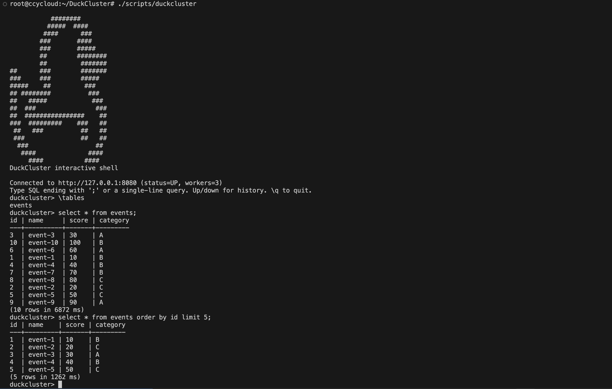

# DuckCluster CLI

Python client for the coordinator REST API.



## Prerequisites

```bash
./scripts/start-cluster.sh    # coordinator + workers must be running
```

## Interactive shell

**Command:**

```bash
./scripts/duckcluster
# or explicitly:
./scripts/duckcluster shell
```

Running `./scripts/duckcluster` with no arguments opens the shell when stdin is a terminal. Use this for ad-hoc SQL like the Impala/Hive shell.

**Example session:**

```
duckcluster> \tables
events
duckcluster> SELECT * FROM events;
id | name     | score | category
...
(10 rows in 52 ms)
duckcluster> SELECT category, COUNT(*) AS cnt FROM events GROUP BY category
category | cnt
---------+----
A        | 4
...
duckcluster> \status
Cluster: UP
Workers: 3 registered (3 healthy)
Coordinator: http://127.0.0.1:8080
duckcluster> \q
```

| Input | Behaviour |
|-------|-----------|
| `SELECT …;` then Enter | Run query (semicolon stripped before send) |
| `SELECT …` + Enter on one line | Run immediately (no `;` needed) |
| Multiple lines, last line ends with `;` | Multi-line query |
| `\tables` `\status` `\workers` `\help` `\q` | Shell meta-commands |
| Up / Down | Previous queries, stored **as typed** (with `;` if you used one) |

**Tips**

- `ORDER BY` before `LIMIT`: `SELECT … ORDER BY id LIMIT 5` (not `LIMIT 5 ORDER BY id`).
- History file: `~/.duckcluster_history` (override with `DUCKCLUSTER_HISTORY`).

## One-shot `query` command

**Command:**

```bash
./scripts/duckcluster query "<SQL>"
./scripts/duckcluster query -f path/to/query.sql
```

**Examples:**

```bash
# Table output (default on a TTY)
./scripts/duckcluster query "SELECT COUNT(*) FROM events"

# JSON for piping
./scripts/duckcluster query "SELECT COUNT(*) FROM events" --format json | jq .

# From file + timing stats on stderr
./scripts/duckcluster query -f report.sql -v

# Remote coordinator
./scripts/duckcluster --url http://coordinator:8080 query "SELECT 1"
```

Use `query` in scripts and CI; use `shell` for interactive exploration.

## `status` and `workers`

```bash
./scripts/duckcluster status
./scripts/duckcluster workers
./scripts/duckcluster workers --format json
```

## Install on PATH

```bash
pip install -e cli/
duckcluster shell
duckcluster query "SELECT 1"
```

## Flags

| Flag / env | Default | Purpose |
|------------|---------|---------|
| `--url` / `DUCKCLUSTER_URL` | `http://127.0.0.1:8080` | Coordinator base URL |
| `--timeout` / `DUCKCLUSTER_TIMEOUT` | `300` | HTTP timeout (seconds) |
| `--format json\|table` | `table` on TTY, `json` when piped | Output format |
| `-v` / `--verbose` | off | Query stats on stderr |
| `--no-validate` | off | Skip pre-flight catalog checks |

## Pre-flight checks

Before running SQL, the CLI checks: cluster `UP`, healthy workers, tables in shard catalog, shards have owners.

## Exit codes

| Code | Meaning |
|------|---------|
| 0 | Success |
| 1 | Coordinator error |
| 2 | Local error (connection, validation, bad args) |

## Development

```bash
cd cli && python3 -m unittest discover -s tests
```
